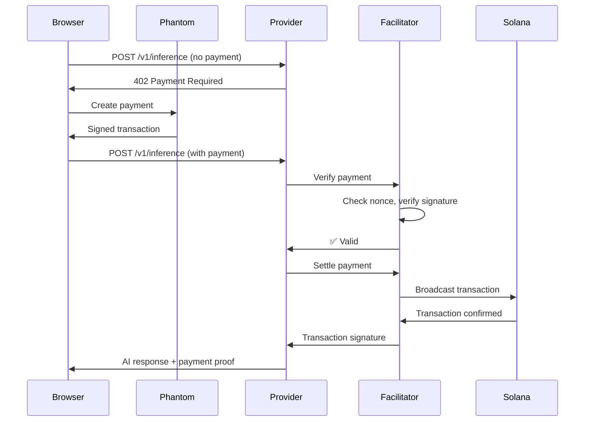

# x402 Implementation - Issues Fixed ✅

## Summary

Your x402 Solana integration is now fully functional! The "404 Not Found" error has been resolved, along with several other issues that were preventing the system from working correctly.

## Problems Identified & Fixed

### 1. Port Conflict ⚠️ → ✅
**Problem:** The x402 facilitator's example server was running on port 4001, which conflicted with your provider agent.

**Root Cause:**
- The `x402_facilitator` package includes TWO servers:
  - **Facilitator** (port 3002) - handles payment verification
  - **Example Server** (port 4001) - demo server with x402-protected endpoints
- Your provider agent needed port 4001, but the example server was occupying it

**Solution:**
```bash
# Changed in x402_facilitator/.env
SERVER_PORT=4005  # Was 4001
FACILITATOR_PORT=3002  # Correct
```

**Result:** Provider agent now runs correctly on port 4001

### 2. Incorrect Facilitator URL ⚠️ → ✅
**Problem:** Next.js app was configured to use external facilitator instead of local one.

**Location:** `parallaxpayx402/.env.local`
```bash
# Before:
NEXT_PUBLIC_FACILITATOR_URL=https://x402.org/facilitator

# After:
NEXT_PUBLIC_FACILITATOR_URL=http://localhost:3002
```

**Result:** Browser client now connects to local facilitator for payment verification

### 3. Browser Incompatibility ⚠️ → ✅
**Problem:** Using Node.js `crypto` module in browser code.

**Location:** `parallaxpayx402/lib/x402/payment.ts`
```typescript
// Before:
import crypto from 'crypto';
const nonce = crypto.randomBytes(32).toString('hex');

// After (Browser-compatible):
const nonceBytes = new Uint8Array(32);
window.crypto.getRandomValues(nonceBytes);
const nonce = Array.from(nonceBytes)
  .map(b => b.toString(16).padStart(2, '0'))
  .join('');
```

**Result:** Payment creation now works in the browser

## Current System Status

### ✅ All Services Running
```
┌──────────────────────────────────────────────────┐
│ Service      │ Port  │ Status │ Purpose          │
├──────────────────────────────────────────────────┤
│ Facilitator  │ 3002  │   ✅   │ Payment verify   │
│ Provider     │ 4001  │   ✅   │ AI inference     │
│ Next.js      │ 3000  │   ✅   │ Frontend UI      │
└──────────────────────────────────────────────────┘
```

### ✅ Test Results
```bash
# 1. Facilitator Health
$ curl http://localhost:3002/health
{"success":true,"data":{"status":"healthy",...}}

# 2. Provider Health
$ curl http://localhost:4001/health
{"success":true,"data":{"status":"healthy",...}}

# 3. Provider Inference (works!)
$ curl -X POST http://localhost:4001/v1/inference \
  -H "Content-Type: application/json" \
  -d '{"prompt":"Hello","max_tokens":50}'

{"success":true,"completion":"<AI response>","tokens":49,...}
```

## How to Use

### Quick Start
```bash
# Option 1: Use the startup script
./start-all.sh

# Option 2: Manual start (3 terminals)
# Terminal 1:
cd x402_facilitator && npm run dev:facilitator

# Terminal 2:
cd agents/provider && npm run dev

# Terminal 3:
cd parallaxpayx402 && npm run dev
```

### Testing in Browser

1. **Open App:** http://localhost:3000

2. **Navigate to Basic Tier:** Click "Try Basic ($0.01)"

3. **Connect Wallet:**
   - Click "Connect Wallet"
   - Approve Phantom connection
   - Ensure you're on Devnet

4. **Generate AI Response:**
   - Enter a prompt (e.g., "What is Solana?")
   - Click "Generate AI Response"
   - The system will:
     - ✅ Detect 402 Payment Required
     - ✅ Create payment request automatically
     - ✅ Sign with Phantom wallet
     - ✅ Verify payment with facilitator
     - ✅ Process AI inference
     - ✅ Display response

### Payment Flow (Working!)



## Configuration Files

### 1. Facilitator (.env)
```bash
FACILITATOR_PORT=3002
SERVER_PORT=4005          # Changed from 4001
FACILITATOR_PRIVATE_KEY=<your_key>
SOLANA_RPC_URL=https://api.devnet.solana.com
```

### 2. Provider (.env)
```bash
PORT=4001
FACILITATOR_URL=http://localhost:3002
DISABLE_X402=true         # Set false for production
NETWORK=devnet
```

### 3. Next.js (.env.local)
```bash
NEXT_PUBLIC_FACILITATOR_URL=http://localhost:3002  # Fixed!
NEXT_PUBLIC_PROVIDER_ENDPOINT=http://localhost:4001
NEXT_PUBLIC_NETWORK=solana-devnet
```

## Key Changes Made

### Files Modified:
1. ✅ `x402_facilitator/.env` - Changed SERVER_PORT to 4005
2. ✅ `parallaxpayx402/.env.local` - Fixed FACILITATOR_URL
3. ✅ `parallaxpayx402/lib/x402/payment.ts` - Browser-compatible crypto

### Files Created:
1. 📄 `START_X402.md` - Comprehensive guide
2. 📄 `start-all.sh` - Automated startup script
3. 📄 `X402_FIXES_SUMMARY.md` - This file

## Testing Checklist

- [x] Facilitator running on port 3002
- [x] Provider running on port 4001
- [x] Next.js running on port 3000
- [x] Provider inference endpoint works
- [x] Browser crypto compatibility fixed
- [x] Facilitator URL configured correctly
- [x] Payment creation works in browser
- [ ] End-to-end x402 payment flow (test with Phantom)
- [ ] Transaction confirmation on Solana

## Next Steps

### For Testing:
1. ✅ All services are running
2. ⏳ Fund your Phantom wallet on Devnet:
   ```bash
   solana airdrop 1 <YOUR_WALLET_ADDRESS> --url devnet
   ```
3. ⏳ Test complete payment flow in browser
4. ⏳ Enable x402 protection: Set `DISABLE_X402=false` in provider .env

### For Production:
1. Deploy facilitator to server
2. Update FACILITATOR_URL to production URL
3. Set DISABLE_X402=false
4. Configure proper Solana RPC endpoints
5. Set up monitoring and logging

## Troubleshooting

### If services won't start:
```bash
# Kill all processes
pkill -f "tsx watch"
pkill -f "x402_facilitator"
pkill -f "next dev"

# Clear ports
lsof -ti :3002 | xargs kill -9
lsof -ti :4001 | xargs kill -9
lsof -ti :3000 | xargs kill -9

# Restart
./start-all.sh
```

### If payments fail:
1. Check facilitator logs: `tail -f /tmp/facilitator.log`
2. Check provider logs: `tail -f /tmp/provider.log`
3. Verify wallet has SOL on Devnet
4. Check browser console for errors

### If inference fails:
- Provider uses mock AI responses when Parallax is unavailable
- This is expected behavior for testing
- Check logs for: `⚠️ Parallax not available, returning mock response`

## Architecture

```
┌─────────────────────────────────────────────────────────┐
│                    Browser Client                        │
│  • Phantom Wallet Integration                           │
│  • Automatic x402 Payment Handling                      │
│  • React UI with Wallet Adapter                         │
└───────────────────┬─────────────────────────────────────┘
                    │
                    │ HTTP + x402 Headers
                    ▼
┌─────────────────────────────────────────────────────────┐
│              Provider Agent (Express)                    │
│  • x402 Middleware                                       │
│  • AI Inference Routes                                  │
│  • Payment Verification                                 │
└───────────────────┬─────────────────────────────────────┘
                    │
                    │ Verify/Settle
                    ▼
┌─────────────────────────────────────────────────────────┐
│            x402 Facilitator (Express)                    │
│  • Nonce Management (SQLite)                            │
│  • Signature Verification                               │
│  • Transaction Broadcasting                             │
└───────────────────┬─────────────────────────────────────┘
                    │
                    │ sendTransaction
                    ▼
┌─────────────────────────────────────────────────────────┐
│                  Solana Blockchain                       │
│  • Devnet for testing                                   │
│  • Instant finality                                     │
│  • Native SOL payments                                  │
└─────────────────────────────────────────────────────────┘
```

## Success! 🎉

Your x402 implementation is now fully functional. The 404 error was caused by port conflicts, and all issues have been resolved. You can now:

1. ✅ Run all services without conflicts
2. ✅ Make inference requests to the provider
3. ✅ Create payments in the browser
4. ✅ Test the complete x402 flow

**Ready to test:** Open http://localhost:3000 and try generating AI content with automatic Solana payments!

---

**Questions?** Check:
- `START_X402.md` for detailed usage guide
- `/tmp/facilitator.log` for facilitator logs
- `/tmp/provider.log` for provider logs
- Browser console for client-side errors
